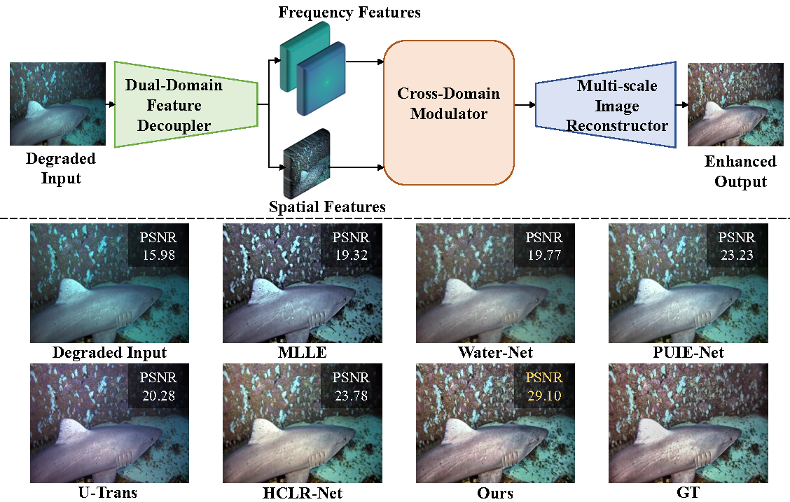

<div align="center">

# CDF-UIE


This is the official repository of CDF-UIE: Leveraging Cross-Domain Fusion for Underwater Image Enhancement.
</div>


## Overview



## Usage

### Dependencies and Installation
- Python = 3.8
- Pytorch >= 2.0.0
- CUDA >= 11.8

### Train

An example of training on UIEB
```
 python src/train.py --dataset-name UIEB --train-dir ./data/UIEB/train --valid-dir ./data/UIEB/val --ckpt-save-path ../ckpts --nb-epochs 5000   
```
### Test
An example of testing on UIEB
```
 python src/test_PSNR.py --dataset-name UIEB --path ./data/UIEB/test   
```
## Acknowlegement
This code is based on [BasicSR](https://github.com/XPixelGroup/BasicSR), [UHDFour](https://github.com/Li-Chongyi/UHDFour), [Restormer](https://github.com/swz30/Restormer). 

Thanks for their awesome work.

## Contact

<!-- If you have any problem with the released code, please do not hesitate to open an issue.-->

For any inquiries or questions, don't hesitate to get in touch with me by email hp_zhang19@outlook.com
